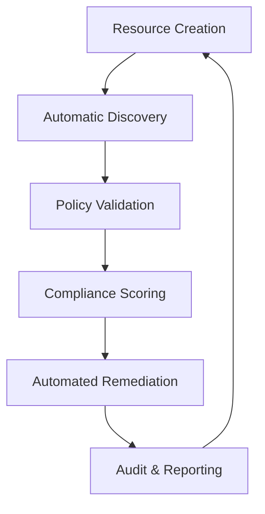
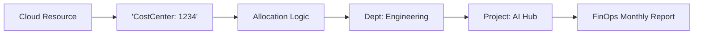
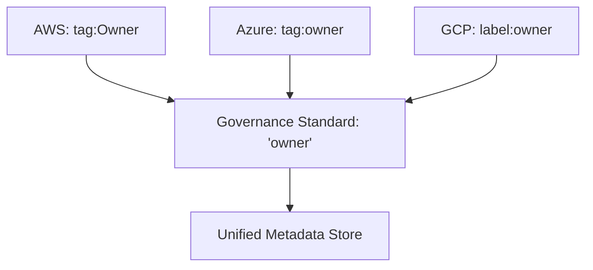
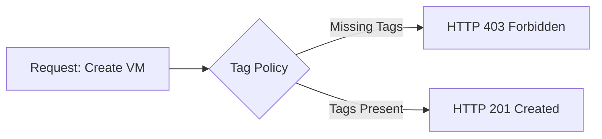
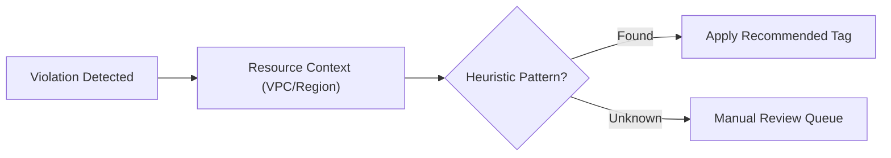
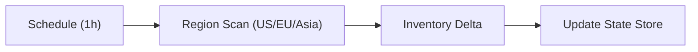
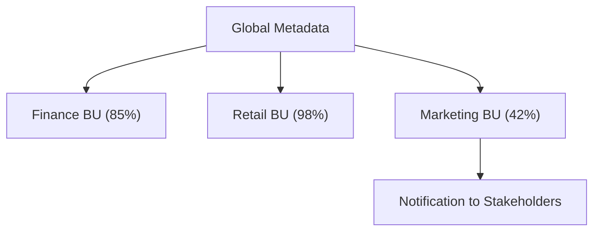
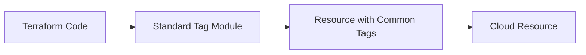
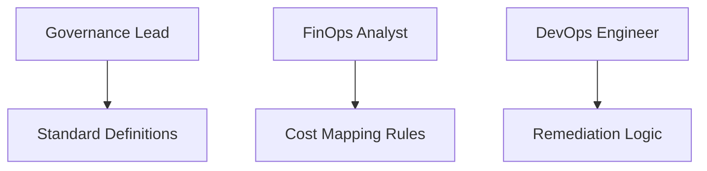

<div align="center">


<h1>Tagging Governance Toolkit</h1>

<p><strong>The Strategic Foundation for Enterprise Metadata Enforcement, Multi-Cloud Cost Allocation, and Automated Remediation Intelligence.</strong></p>

[]()
[]()
[]()

<br/>

> **"If it's not tagged, it doesn't exist."** 
> **Tagging Governance Toolkit (Tag-Gov)** is an institutional-grade platform designed to provide a secure, measurable, and highly automated foundation for global cloud metadata management. It orchestrates the entire lifecycle—from resource scanning to real-time remediation and financial cost allocation.

</div>

---

## 🏛️ Executive Summary

Cloud resources without proper metadata are financial and operational liabilities. Organizations often fail to meet governance targets not because of a lack of intent, but because of fragmented tagging standards and an inability to map thousands of disparate resources to specific cost centers and owners.

This platform provides the **Tagging Governance Plane**. It implements a complete **Enterprise Metadata Framework**, enabling FinOps and Engineering teams to manage resource metadata as a first-class citizen. By automating the discovery and remediation phases, we ensure that every cloud resource is continuously validated and aligned with strategic financial and compliance goals.

---

## 📐 Architecture Storytelling: Principal Reference Models

### 1. Principal Architecture: Enterprise Metadata Governance Plane
This diagram illustrates the end-to-end flow from multi-cloud resource discovery to automated remediation and FinOps cost reporting.

```mermaid
graph LR
    %% Subgraph Definitions
    subgraph MultiCloud["Multi-Cloud Infrastructure"]
        direction TB
        AWS["AWS Resources"]
        Azure["Azure Resources"]
        GCP["GCP Resources"]
    end

    subgraph Discovery["Resource Discovery Plane"]
        direction TB
        Scanner["Multi-Cloud Inventory Scanner"]
        Parser["Metadata Normalization Hub"]
        Inventory["Resource State Store"]
    end

    subgraph Intelligence["Governance Intelligence Engine"]
        direction TB
        API["FastAPI Governance Gateway"]
        Policy["Tagging Policy Engine (Schema)"]
        Remediation["Heuristic Remediation Engine"]
        Compliance["Compliance Scoring Hub"]
    end

    subgraph Ops["Governance & FinOps Operations"]
        direction TB
        Dash["Unified Governance Dashboard"]
        Cost["Cost Allocation Modeler"]
        Audit["Immutable Audit Records"]
    end

    subgraph DevOps["IaC & Policy Orchestration"]
        direction TB
        GH["GitHub Actions Pipelines"]
        TF["Terraform Governance Modules"]
        PolicyCode["Policy-as-Code (Azure/AWS Policy)"]
    end

    %% Flow Arrows
    MultiCloud -->|1. Periodic Scan| Scanner
    Scanner -->|2. Parse Metadata| Parser
    Parser -->|3. Store Inventory| Inventory
    
    Inventory -->|4. Validate| Policy
    Policy -->|5. Score| Compliance
    Compliance -->|6. Violation| Remediation
    Remediation -->|7. Auto-Tag| MultiCloud
    
    Compliance -->|8. Report| Dash
    Dash -->|9. Map| Cost
    Cost -->|10. Budget| Audit
    
    GH -->|11. Provision| TF
    TF -->|12. Enforce| PolicyCode
    PolicyCode -->|13. Guardrails| MultiCloud

    %% Styling
    classDef cloud fill:#f5f5f5,stroke:#616161,stroke-width:2px;
    classDef disc fill:#fff3e0,stroke:#e65100,stroke-width:2px;
    classDef intel fill:#ede7f6,stroke:#311b92,stroke-width:2px;
    classDef ops fill:#fce4ec,stroke:#880e4f,stroke-width:2px;
    classDef devops fill:#fffde7,stroke:#f57f17,stroke-width:2px;

    class MultiCloud cloud;
    class Discovery disc;
    class Intelligence intel;
    class Ops ops;
    class DevOps devops;
```



### 2. Tagging Lifecycle Loop: Continuous Governance
The circular process of maintaining metadata health across the environment.



### 3. FinOps Cost Attribution: Metadata to Money
How the platform maps technical tags to organizational financial structures.



### 4. Multi-Cloud Metadata Hub: Normalized Schema
Normalizing disparate metadata formats from AWS, Azure, and GCP into a single standard.



### 5. Policy-as-Code Enforcement: Cloud Guardrails
Preventing the creation of untagged resources using native cloud policies.



### 6. Automated Remediation Pipeline: Heuristic Matching
Identifying and fixing tagging violations without manual intervention.



### 7. Resource Discovery & Inventory Plane
Periodic, scheduled scanning of the global cloud footprint to extract current state.



### 8. Compliance Scorecard Flow: BU Accountability
Visualizing tagging health across different Business Units.



### 9. IaC Tag Injection: Standardizing at Birth
Ensuring every resource is tagged correctly during the Terraform apply phase.



### 10. Identity & Governance RBAC
Who manages the metadata standards and remediation rules.



---

## 🏛️ Core Platform Pillars

1.  **Tagging Policy Engine**: Centralized hub for defining granular tagging standards and required schemas.
2.  **Multi-Cloud Scanning Engine**: Intelligent discovery of resources across AWS, Azure, and GCP to extract metadata.
3.  **Automated Remediation Engine**: Heuristic-driven engine that auto-applies missing tags to bring resources into compliance.
4.  **Financial Cost Allocation**: Dynamic mapping of resource metadata to organizational cost centers and departments.
5.  **Real-time Drift Detection**: Continuous monitoring of tag changes to identify and revert unauthorized modifications.
6.  **Unified Governance Dashboard**: Deep monitoring of compliance scores, violation trends, and unallocated cost risks.

---

## 🛠️ Technical Stack & Implementation

### Platform Engine & APIs
*   **Framework**: Python 3.11+ / FastAPI.
*   **Discovery Engine**: Specialized multi-cloud connectors for AWS Resource Groups Tagging API and Azure Graph.
*   **State Management**: PostgreSQL for resource inventory and metadata history.
*   **Orchestration**: Redis for high-speed scanning tasks and policy caching.

### Governance Command Center
*   **Framework**: React 18 / Vite.
*   **Theme**: Indigo / Slate (Modern Governance & FinOps aesthetic).
*   **Visualization**: Recharts for compliance scorecards and violation break downs.

### Infrastructure & DevOps
*   **Runtime**: AWS EKS or Azure Kubernetes Service (AKS).
*   **Infrastructure as Code**: Modular Terraform for deploying the governance hub and scanning workers.

---

## 🏗️ IaC Mapping (Module Structure)

| Module | Purpose | Real Services |
| :--- | :--- | :--- |
| **`infrastructure/governance`** | The management plane | EKS, PostgreSQL, Redis |
| **`infrastructure/scanners`** | Cloud-specific discovery nodes | Lambda, Azure Functions, Cloud Run |
| **`infrastructure/policies`** | Native cloud guardrails | Azure Policy, AWS Config, SCPs |
| **`infrastructure/reporting`** | FinOps and compliance sinks | Athena, Kinesis, Grafana |

---

## 🚀 Deployment Guide

### Local Principal Environment
```bash
# Clone the governance toolkit
git clone https://github.com/devopstrio/tagging-governance-toolkit.git
cd tagging-governance-toolkit

# Configure environment
cp .env.example .env

# Launch the Governance stack
make up

# Trigger a resource inventory scan
make scan-resources

# Validate inventory against standards
make validate-tags
```

Access the Governance Command Center at `http://localhost:3000`.

---

## 📜 License
Distributed under the MIT License. See `LICENSE` for more information.

---
<div align="center">
  <p>© 2026 Devopstrio. All rights reserved.</p>
</div>
