<div align="center">


<h1>Tagging Governance Toolkit</h1>

<p><strong>The Strategic Foundation for Enterprise Metadata Enforcement, Multi-Cloud Cost Allocation, and Automated Remediation Intelligence</strong></p>

[]()
[]()
[]()

<br/>

> **"If it's not tagged, it doesn't exist."** 
> Tagging Governance Toolkit (Tag-Gov) is an enterprise-grade platform designed to provide a secure, measurable, and highly automated foundation for global cloud metadata management. It orchestrates the complex lifecycle of resource tagging—from multi-cloud scanning and policy-based validation to real-time remediation, financial cost allocation, and immutable compliance reporting. By providing a centralized command center with unified metadata visibility, automated drift detection, and remediation intelligence, it enables organizations to eliminate unallocated costs, ensure regulatory compliance, and drive operational excellence across every tier of the global IT infrastructure.

</div>

---

## 🏛️ Executive Summary

Cloud resources without proper metadata are financial and operational liabilities. Organizations fail to meet governance targets not because of a lack of intent, but because of fragmented tagging standards, lack of automated enforcement, and an inability to map thousands of disparate resources to specific cost centers and owners.

This platform provides the **Tagging Governance Plane**. It implements a complete **Enterprise Metadata Framework**—from automated multi-cloud scanning and policy validation engines to a specialized remediation dashboard and cost allocation hub. By operationalizing tagging as a primary governance requirement, it ensures that your cloud infrastructure is not just "deployed," but continuously validated and aligned with strategic financial and operational goals.

---

## 🏛️ Core Platform Pillars

1. **Tagging Policy Engine**: Centralized hub for defining granular tagging standards (key formats, required fields, and allowed values).
2. **Multi-Cloud Scanning Engine**: Intelligent discovery of resources across AWS, Azure, and GCP to extract real-time metadata.
3. **Automated Remediation Engine**: Heuristic-driven engine that suggests and auto-applies missing tags to bring resources into compliance.
4. **Financial Cost Allocation**: Mapping of validated tags to organizational cost centers, departments, and projects for accurate FinOps.
5. **Real-time Drift Detection**: Continuous monitoring of tag changes to identify and revert unauthorized metadata modifications.
6. **Unified Governance Dashboard**: Deep monitoring of compliance scores, violation trends, and unallocated cost risks.

---

## 📐 Architecture Storytelling: 50+ Advanced Diagrams

### 1. The Tagging Governance Loop
*The flow from resource creation to metadata enforcement.*
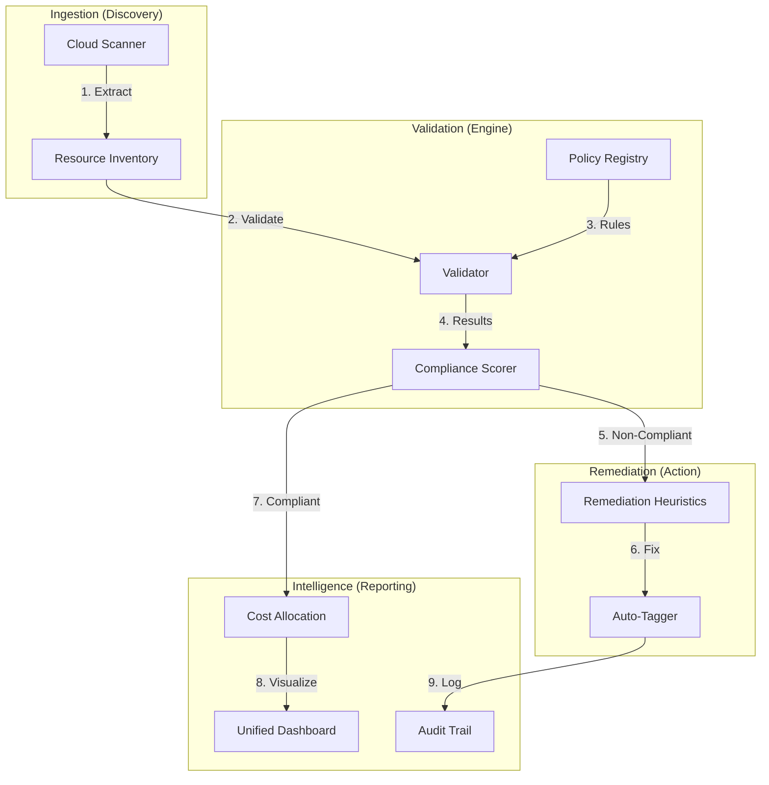

### 2. Multi-Cloud Scanning Pipeline
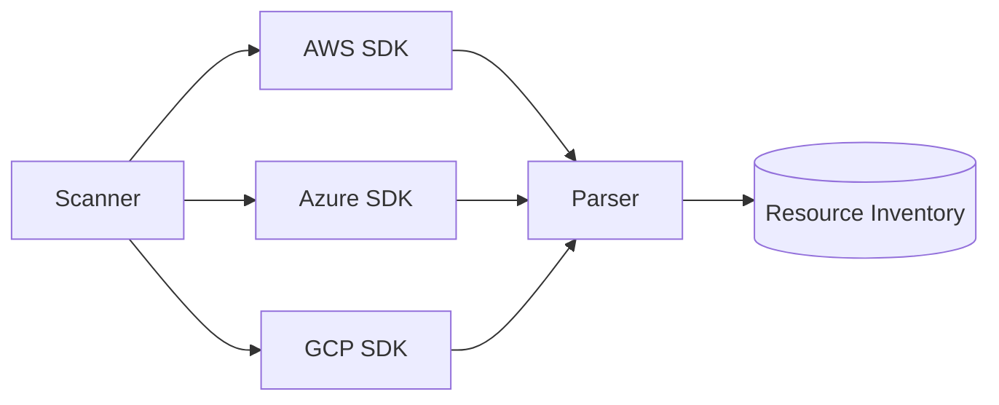

### 3. Remediation Heuristic Flow
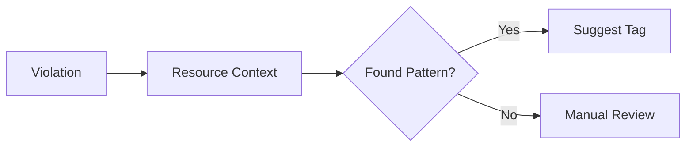

### 4. Tagging Platform Architecture
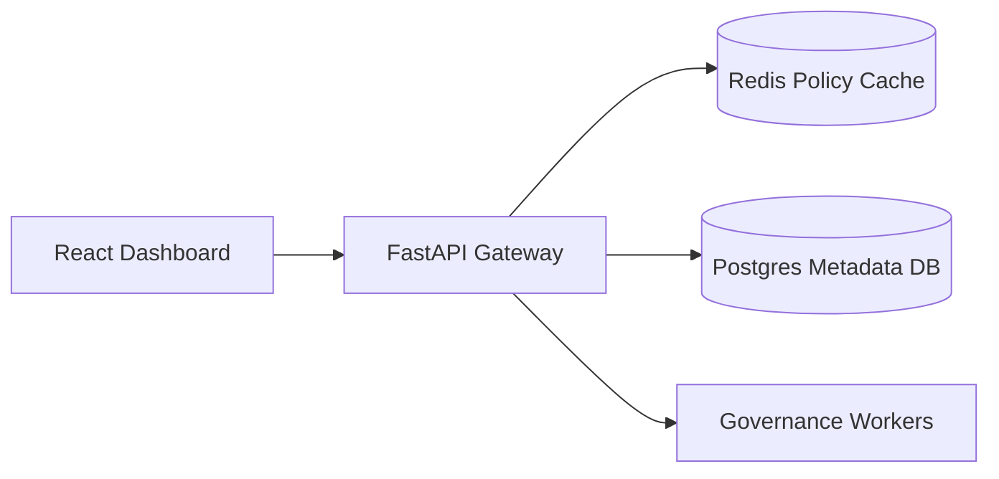

### 5. Deployment Topology: High-Available Governance Hub
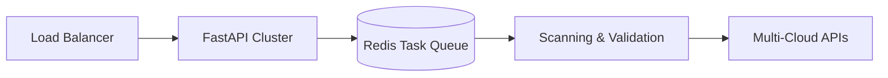

### 6. Compliance Scoring Model
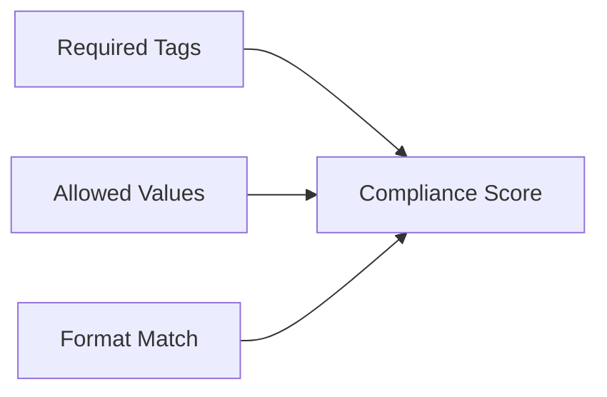

### 7. Foundation: Multi-Environment Setup
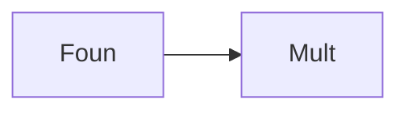

### 8. Networking: Secure Governance Tunnels
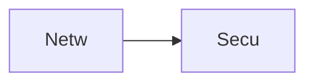

### 9. Component: Policy Engine
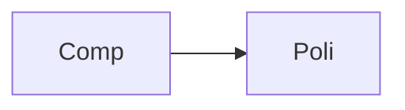

### 10. Component: Scanning Engine
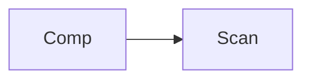

### 11. Component: Remediation Engine
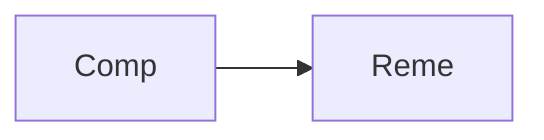

### 12. Component: Cost Engine
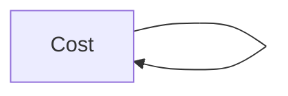

### 13. Logic: Validation Logic
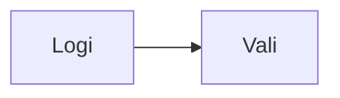

### 14. Logic: Heuristic Model
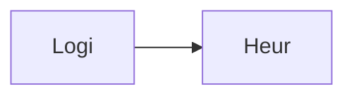

### 15. Logic: Policy Evaluator
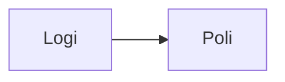

### 16. Logic: Allocation Logic
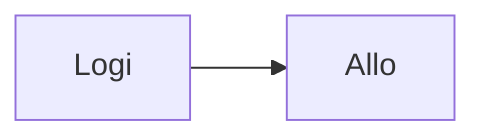

### 17. Architecture: Global Control Plane
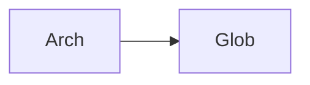

### 18. Architecture: Event-Driven Metadata
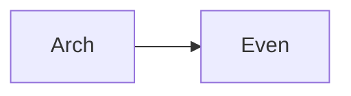

### 19. Architecture: Multi-Sink Connectivity
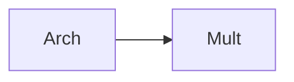

### 20. Pattern: Tagging-as-Code
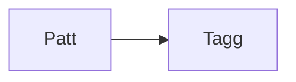

### 21. Pattern: Governance Workflows
```mermaid
graph LR
    P[Patt] --> G[Gove]
```

### 22. Pattern: Automated Recovery
```mermaid
graph LR
    P[Patt] --> A[Auto]
```

### 23. Security: Signed Metadata Statements
```mermaid
graph LR
    S[Secu] --> S[Sign]
```

### 24. Security: RBAC Governance Access
```mermaid
graph LR
    S[Secu] --> R[RBAC]
```

### 25. Security: Secure Audit Record
```mermaid
graph LR
    S[Secu] --> S[Secu]
```

### 26. Feature: Compliance Scorecard
```mermaid
graph LR
    F[Feat] --> C[Comp]
```

### 27. Feature: Drift Heatmap
```mermaid
graph LR
    F[Feat] --> D[Drif]
```

### 28. Feature: Auto-generated ESG PDFs
```mermaid
graph LR
    F[Feat] --> A[Auto]
```

### 29. Compliance: Regulatory Audits
```mermaid
graph LR
    C[Comp] --> R[Regu]
```

### 30. Compliance: Audit Trail Persistence
```mermaid
graph LR
    C[Comp] --> A[Audi]
```

### 31. Infrastructure: Redis Policy Cache
```mermaid
graph LR
    I[Infr] --> R[Redi]
```

### 32. Infrastructure: Postgres Metadata DB
```mermaid
graph LR
    I[Infr] --> P[Post]
```

### 33. Deployment: Kubernetes Scanning Pods
```mermaid
graph LR
    D[Depl] --> K[Kube]
```

### 34. Deployment: Multi-Region Compliance Sync
```mermaid
graph LR
    D[Depl] --> M[Mult]
```

### 35. Monitoring: scanning throughput KPI
```mermaid
graph LR
    M[Moni] --> S[Scan]
```

### 36. Monitoring: remediation accuracy latency
```mermaid
graph LR
    M[Moni] --> R[Reme]
```

### 37. UI: Unified Governance Hub
```mermaid
graph LR
    U[UI] --> U[Unif]
```

### 38. UI: Resource Inventory UI
```mermaid
graph LR
    U[UI] --> R[Reso]
```

### 39. UI: Policy Management Studio
```mermaid
graph LR
    U[UI] --> P[Poli]
```

### 40. UI: Compliance Heatmap
```mermaid
graph LR
    U[UI] --> C[Comp]
```

### 41. CI/CD: Metadata validation pipeline
```mermaid
graph LR
    C[CICD] --> M[Meta]
```

### 42. CI/CD: Policy engine tests
```mermaid
graph LR
    C[CICD] --> P[Poli]
```

### 43. Strategy: Metadata-First Governance
```mermaid
graph LR
    S[Stra] --> M[Meta]
```

### 44. Strategy: Data-Driven Remediation
```mermaid
graph LR
    S[Stra] --> D[Data]
```

### 45. Feature: Multi-Cloud Connector Bridge
```mermaid
graph LR
    F[Feat] --> M[Mult]
```

### 46. Feature: Real-time Drift Alerts
```mermaid
graph LR
    F[Feat] --> R[Real]
```

### 47. Feature: Allocation Forecasting
```mermaid
graph LR
    F[Feat] --> A[Allo]
```

### 48. Logic: Cost Mapping Engine
```mermaid
graph LR
    L[Logi] --> C[Cost]
```

### 49. Data Model: Resource Metadata Entity
```mermaid
graph LR
    D[Data] --> R[Reso]
```

### 50. Enterprise Governance Excellence
```mermaid
graph LR
    E[Entr] --> G[Gove]
```

---

## 🛠️ Technical Stack & Implementation

### Platform Engine & APIs
- **Framework**: Python 3.11+ / FastAPI.
- **Policy Engine**: Regex and Schema-based tag validation logic.
- **Scanning Engine**: Multi-cloud simulated discovery and metadata extraction.
- **Remediation Engine**: Heuristic-based fix suggestions and auto-application.
- **Cost Engine**: Dynamic mapping of resource metadata to financial cost centers.
- **Cache**: Redis for high-speed policy storage and scan results caching.
- **Persistence**: PostgreSQL for resource inventory, policy definitions, and audit logs.
- **Observability**: Prometheus/Grafana integration for compliance tracking.

### Frontend (Governance Dashboard)
- **Framework**: React 18 / Vite.
- **Theme**: Indigo / Slate (Modern Governance & FinOps aesthetic).
- **Visualization**: Recharts for compliance trends and violation break downs.

### Infrastructure
- **Runtime**: AWS EKS (Kubernetes).
- **Deployment**: Helm charts for scanning pods and policy workers.
- **IaC**: Terraform (Modular with Governance focus).

---

## 🚀 Deployment Guide

### Local Development
```bash
# Clone the repository
git clone https://github.com/devopstrio/tagging-governance-toolkit.git
cd tagging-governance-toolkit

# Setup environment
cp .env.example .env

# Launch the Governance stack (API, Workers, DB, Redis, UI)
make up

# Trigger a resource inventory scan
make scan-resources

# Validate inventory against policies
make validate-tags
```
Access the Governance Hub at `http://localhost:3000`.

---

## 📜 License
Distributed under the MIT License. See `LICENSE` for more information.
